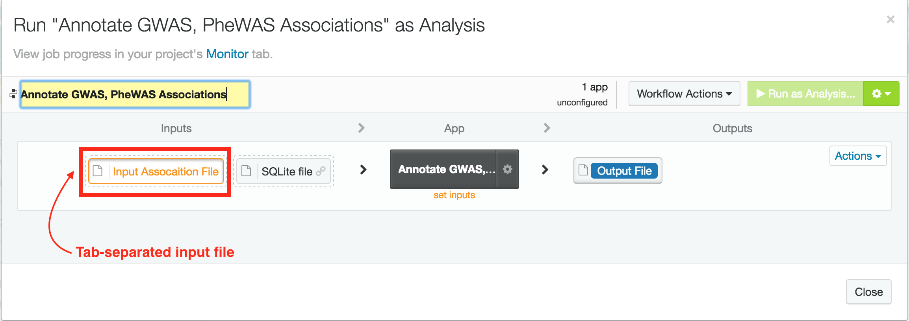
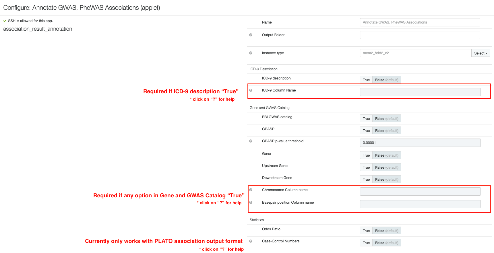

<!-- dx-header -->
# Annotate GWAS, PheWAS Associations (DNAnexus Platform App)
<!-- /dx-header -->

## What does this app do?

This app annotates GWAS or PheWAS association results with Genes, GWAS Catalogs, Odds Ratios, and Phenotype long descriptions (mainly ICD-9 codes).
It can also annotate the following irrespective of association results:

- SNP with Gene: Provide chromosome and base pair location as an input file and select gene annotation options.
- SNP with EBI GWAS catalog and GRASP catalog: Provide chromosome and base pair location as an input file and select GWAS catalog annotation options.
- ICD-9 code with long description: Provide list of ICD-9 codes as an input file and select the ICD-9 annotation option.

## What data are required for this app to run?

- A tab-separated file containing information from a GWAS study (can be generated as output from PLATO). 
- A database file compatible with sqlite3. There are recommended database files suggested on the platform UI.

**Note: App works with human genome build 37 (hs37d5) only!**

## Usage
### Options
#### ICD-9 Description

- **ICD-9 description:** Allows users to add ICD-9 code long descriptions to the column name.
- **ICD-9 column name:** Required if "ICD-9 description" is true. This option allows the app to know which column in the input file contains ICD-9 codes.

**Note: Ensure that the column containing ICD codes is not the first column in the input TSV file.

 

#### Gene and GWAS Catalog

- **EBI GWAS catalog:** Add traits found in EBI GWAS catalog for SNPs position in input file.
- **GRASP:** Add traits found in GRASP GWAS catalog for SNPs position in input file. GRASP has a more thorough list of published GWAS results, including results with p-value < 0.01, making it a bigger database than EBI.
- **GRASP p-value threshold:** We suggest to use a p-value threshold of 1E-05 to reduce the search space and to provide equivalent comparisons with the EBI catalog. You can change the p-value to adjust the search space.
- **Gene:** Map genes to chromosome-base pair positions in input file.
- **Upstream Gene:** Map upstream genes to chromosome-base pair positions in the input file and provide the distance to a given SNP.
- **Downstream Gene:** Map downstream genes to chromosome-base pair positions in the input file and provide the distance to a given SNP.
- **Chromosome column name:** Required if any of the options in "Gene and GWAS Catalog" is set to true. This allows the app to know which column in the input file contains chromosome numbers.
- **Base pair position column name:** Required if any of the options in "Gene and GWAS Catalog" is set to true. This allows the app to know which column in the input file contains base pair positions.

 

**Statistics**

- **Odds Ratio:** Calculate the odds ratio from the beta and standard error in the input file
- **Case-Control Numbers:**

### Example Screenshots
**Step 1**

**Step 2**

## What does this app output?

The output is the same as the input but with additional columns requested for annotation.

## How does this app work?

The app runs on a custom bash script that processes the input file and imports it into a SQLite database. Then, SQLite queries are used to add the requested annotations to the input file. It also uses [Biofilter 2.4](http://ritchielab.psu.edu/files/RL_software/biofilter-manual-2.4.pdf) to annotate SNPs to genes.
